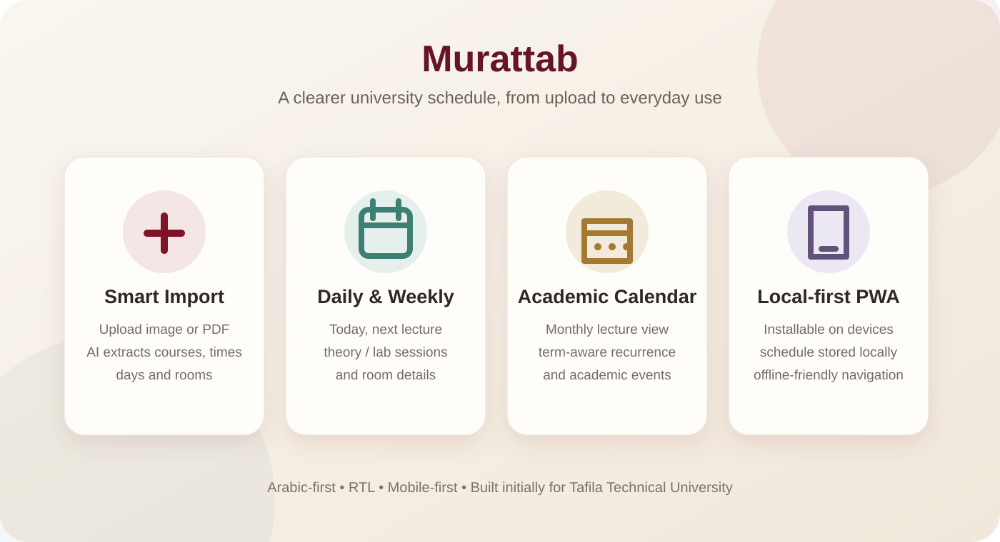
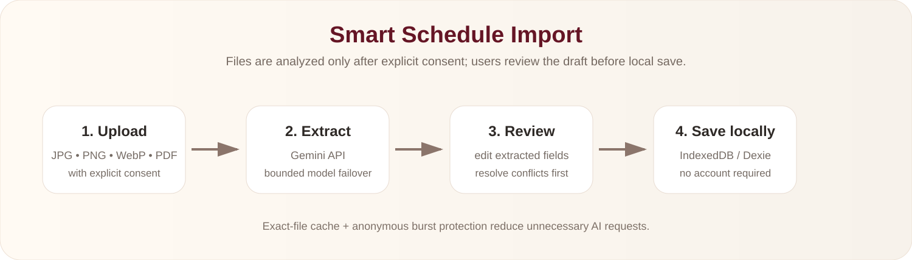

<div align="center">


# مرتب | Murattab

### Smart university schedule organizer for Tafila Technical University students

**Arabic-first • Local-first • Installable PWA • AI-assisted schedule import**

[Live App](https://murattab-pi.vercel.app) · [Report an issue](https://github.com/suhaib458/murattab/issues)


</div>

---

## ما هو «مرتب»؟

**مرتب** هو تطبيق ويب تقدمي (PWA) عربي صُمم لتبسيط تجربة الجدول الجامعي. بدأت الفكرة من مشكلة واقعية: الجداول الجامعية قد تجمع أكثر من يوم وموعد داخل الخلية نفسها، تستخدم اختصارات للأيام، تعرض الوقت بنظام 24 ساعة، وتفصل بين النظري والعملي بطريقة تجعل القراءة اليومية أصعب مما يجب.

الإصدار الأول موجّه لطلاب **جامعة الطفيلة التقنية (TTU)**، ويحوّل الجدول إلى تجربة أوضح: محاضرات اليوم، المحاضرة القادمة، جدول أسبوعي، تقويم شهري، قاعات، تنبيهات، واستيراد ذكي من صورة أو PDF.

> Murattab is an Arabic-first, local-first university schedule organizer. It is built as an installable PWA and is currently optimized for Tafila Technical University.

---

## Project preview



---

## لماذا بنيت المشروع؟

المشكلة الأساسية ليست مجرد “عرض جدول”، بل تحويل بيانات جامعية صعبة القراءة إلى تجربة يومية مفيدة للطالب:

- اختصارات أيام TTU مثل: **ح، ن، ث، ر، خ، س**.
- أكثر من جلسة للمادة الواحدة، مثل نظري وعملي.
- قاعات ومبانٍ مختصرة داخل الجدول.
- أوقات تحتاج إلى تحويل وعرض أوضح.
- حاجة الطالب لمعرفة **ما هي محاضرته القادمة؟ وأين؟ ومتى؟** بدل قراءة جدول كامل كل مرة.

---

## المزايا الرئيسية

| الميزة | ماذا تقدم؟ |
|---|---|
| **الرئيسية** | عرض محاضرات اليوم والمحاضرة القادمة ومعلومات اليوم الدراسي. |
| **جدولي** | تنظيم الجلسات حسب أيام الأسبوع مع فصل النظري والعملي وعرض القاعة والوقت. |
| **التقويم** | عرض شهري للمحاضرات والأحداث الأكاديمية ضمن حدود الفصل الفعلية. |
| **Smart Import** | رفع صورة أو PDF واستخراج المواد والأيام والأوقات والقاعات باستخدام الذكاء الاصطناعي. |
| **مراجعة قبل الحفظ** | لا يتم اعتماد نتيجة الذكاء الاصطناعي مباشرة؛ الطالب يراجع ويعدل ثم يعتمد. |
| **كشف التعارضات** | تنبيه عند وجود تداخل بين جلسات الجدول قبل الحفظ. |
| **إدارة المواد** | إضافة وتعديل وحذف المواد والجلسات يدويًا. |
| **التنبيهات** | إعداد تذكير للمحاضرة قبل بدايتها. |
| **Light / Dark / System** | دعم أوضاع المظهر المختلفة. |
| **Backup / Restore** | تصدير البيانات المحلية واستعادتها بصيغة JSON. |
| **Offline-friendly** | البيانات الأساسية تبقى على الجهاز ويمكن تصفح الجدول بدون اتصال. |
| **PWA** | قابل للتثبيت على الهاتف والكمبيوتر كتطبيق مستقل. |

---

## Smart Schedule Import



تدفق الاستيراد مصمم بحيث تكون **المراجعة البشرية جزءًا أساسيًا من العملية**:

1. يختار الطالب صورة أو PDF.
2. يوافق صراحة على إرسال الملف للتحليل.
3. يتم إرسال الملف إلى Gemini API من خلال Route server-side.
4. يتم استخراج مسودة للمواد والجلسات.
5. الطالب يراجع الأيام، الأوقات، القاعات والنظري/العملي.
6. يتم التحقق من الحقول والتعارضات.
7. بعد الموافقة فقط يتم حفظ البيانات محليًا.

### AI reliability & quota protection

طبقة التحليل الحالية تتضمن:

- سلسلة failover بين نماذج Gemini المهيأة في متغيرات البيئة.
- الانتقال للنموذج التالي فقط عند الأخطاء المؤقتة المناسبة مثل `429` و`503`.
- Timeout محدود لكل عملية تحليل.
- حماية من الطلبات المتكررة لنفس المستخدم المجهول.
- حماية من burst requests.
- دمج الطلبات المتزامنة لنفس الملف في عملية واحدة.
- Cache مؤقت للنتيجة عند رفع **نفس الملف تمامًا** مرة أخرى.
- لا يتم الاحتفاظ بالملف الخام داخل Cache النتائج.

> AI availability and free-tier quotas are controlled by the external provider and are not guaranteed by this repository.

---

## Local-first privacy model

مرتب لا يحتاج حسابًا أو تسجيل دخول في الإصدار الحالي.

- المواد والجلسات والإعدادات تُحفظ في **IndexedDB** عبر Dexie.
- ملف الطالب الأكاديمي المستخدم داخل التطبيق محلي.
- لا توجد قاعدة بيانات سحابية لحفظ الجداول في V1.
- رفع صورة/PDF للتحليل السحابي يتم فقط بعد موافقة صريحة.
- مفتاح Gemini موجود server-side ولا يتم تعريضه للمتصفح.
- النسخ الاحتياطي والاستعادة تتم بملف JSON يملكه المستخدم.

---

## TTU-specific normalization

### رموز الأيام

| الرمز | اليوم |
|---|---|
| س | السبت |
| ح | الأحد |
| ن | الاثنين |
| ث | الثلاثاء |
| ر | الأربعاء |
| خ | الخميس |

الجمعة غير مستخدمة كحالة محاضرات اعتيادية في نموذج الجدول الحالي.

### أمثلة على رموز القاعات

يدعم المشروع توسيع عدد من اختصارات TTU المعروفة، مثل:

- **م** → مجمع القاعات
- **هـ** → الهندسة
- **ع** → الأعمال
- تسميات مختبرات ICT المدعومة في طبقة التطبيع

---

## Academic calendar awareness

المحاضرات المتكررة لا تظهر إلى ما لا نهاية. العرض اليومي والشهري يحترم حدود الفصل الأكاديمي الفعلية، لذلك:

- لا تظهر محاضرات قبل بداية التدريس.
- لا تظهر محاضرات بعد نهاية التدريس.
- التقويم الأكاديمي الرسمي يعرض كبيانات منفصلة عن جلسات المحاضرات.
- الجدول الأسبوعي يبقى Template أسبوعيًا لتسهيل قراءة نمط الطالب المعتاد.

---

## Architecture

```mermaid
flowchart TD
    UI[Arabic RTL UI / Next.js App Router]
    REPO[Repository abstraction]
    DEXIE[Dexie / IndexedDB]
    DOMAIN[Domain models & schedule logic]
    API[/api/schedule/extract]
    GUARD[AI usage guard]
    GEMINI[Gemini API]
    PWA[Service Worker / Manifest]

    UI --> REPO
    REPO --> DEXIE
    UI --> DOMAIN
    UI --> API
    API --> GUARD
    GUARD --> GEMINI
    DOMAIN --> REPO
    PWA --> UI
```

### Design principles

- **Local-first by default**
- **Server-only secrets**
- **Domain logic separated from React/storage**
- **Repository abstraction for persistence**
- **Explicit user review before AI-generated data is persisted**
- **Mobile-first Arabic RTL UX**
- **Data-driven TTU configuration**
- **Progressive enhancement through PWA capabilities**

---

## Tech stack

| Layer | Technology |
|---|---|
| Framework | Next.js 16 / App Router |
| Language | TypeScript (strict) |
| UI | React 19 + responsive CSS/Tailwind-compatible design tokens |
| Validation | Zod |
| Forms | React Hook Form |
| Local database | Dexie / IndexedDB |
| AI | Google Gemini API |
| PWA | Web App Manifest + Service Worker |
| Testing | Vitest + Playwright |
| Analytics | Vercel Web Analytics |
| Performance | Vercel Speed Insights |
| Hosting | Vercel |
| Package manager | pnpm |

---

## Project structure

```text
src/
├── app/
│   ├── api/schedule/extract/   # AI extraction endpoint
│   ├── calendar/
│   ├── schedule/
│   └── settings/
├── components/                 # Shared app shell and UI
├── config/                     # TTU configuration
├── domain/                     # Models, schedule logic, AI normalization
├── features/
│   ├── calendar/
│   ├── home/
│   ├── onboarding/
│   ├── schedule/
│   ├── settings/
│   ├── smart-import/
│   └── tour/
├── repositories/               # Persistence contracts
├── server/                     # Server-only guards/utilities
├── storage/                    # Dexie/local repository
└── test/                       # Unit/regression tests

playwright/                      # End-to-end tests
public/                          # PWA, icons and branding
docs/                            # Product/technical documentation
```

---

## Run locally

### Requirements

- Node.js compatible with the project lockfile
- pnpm

### Installation

```bash
git clone https://github.com/suhaib458/murattab.git
cd murattab
pnpm install
```

Create your local environment file from `.env.example` and provide the server-side Gemini key when Smart Import is needed.

```bash
pnpm dev
```

Then open:

```text
http://localhost:3000
```

---

## Environment variables

| Variable | Purpose |
|---|---|
| `GEMINI_API_KEY` | Server-side Gemini API key |
| `GEMINI_MODEL` | Primary extraction model |
| `GEMINI_FALLBACK_MODEL` | First fallback model |
| `GEMINI_SECONDARY_FALLBACK_MODEL` | Second fallback model |
| `AI_PROVIDER_TIMEOUT_MS` | Total extraction provider budget |
| `AI_CLIENT_RATE_LIMIT_REQUESTS` | Anonymous-client request guard |
| `AI_CLIENT_RATE_LIMIT_WINDOW_MS` | Client guard time window |
| `AI_GLOBAL_RATE_LIMIT_REQUESTS` | Per-instance burst guard |
| `AI_GLOBAL_RATE_LIMIT_WINDOW_MS` | Burst guard time window |
| `AI_RESULT_CACHE_TTL_MS` | Exact-file result cache lifetime |
| `AI_RESULT_CACHE_MAX_ENTRIES` | Maximum warm-memory cached results |

**Never commit real API keys or `.env` files.**

---

## Useful commands

```bash
pnpm dev
pnpm typecheck
pnpm lint
pnpm test
pnpm test:e2e
pnpm data:validate
pnpm calendar:validate
pnpm build
pnpm start
```

---

## Deployment

The production application is deployed on Vercel:

**https://murattab-pi.vercel.app**

The application uses Vercel Web Analytics and Speed Insights for aggregate usage/performance measurement.

---

## Current scope

### V1 includes

- Tafila Technical University
- Arabic RTL interface
- Local student profile
- Manual schedule management
- AI image/PDF schedule import
- Review-before-save workflow
- Today / weekly / monthly views
- Academic term awareness
- Reminders
- JSON backup/restore
- PWA/offline support
- Light/dark/system themes

### Intentionally not in V1

- User accounts
- Google login
- Cloud schedule synchronization
- Grades / GPA
- Degree-plan management
- Official university student-record access

هذه الحدود مقصودة للحفاظ على نسخة أولى بسيطة، قوية، وخاصة بالطالب.

---

## Visual identity

<div align="center">
  
  &nbsp;&nbsp;&nbsp;
  
  &nbsp;&nbsp;&nbsp;
  
</div>

The launch animation is stored in:

`public/brand/splash.mp4`

---

## Roadmap

Possible future expansion, after validating the TTU version:

- Additional Jordanian universities
- University-specific parsers/configuration
- Optional accounts and cloud sync
- Native mobile packaging if product needs justify it
- More resilient distributed AI quota management
- Official university/API integrations when available and authorized

---

## Disclaimer

**Murattab is an independent student-built project. It is not an official Tafila Technical University application and is not currently connected to the university's student information systems.**

Any future official integration should use authorized university APIs or approved data-access mechanisms only.

---

## Author

Built and maintained by **Suhaib**.

GitHub: [@suhaib458](https://github.com/suhaib458)

---

<div align="center">

**مرتب — لأن جدولك لازم يكون أوضح من هيك.**

</div>
